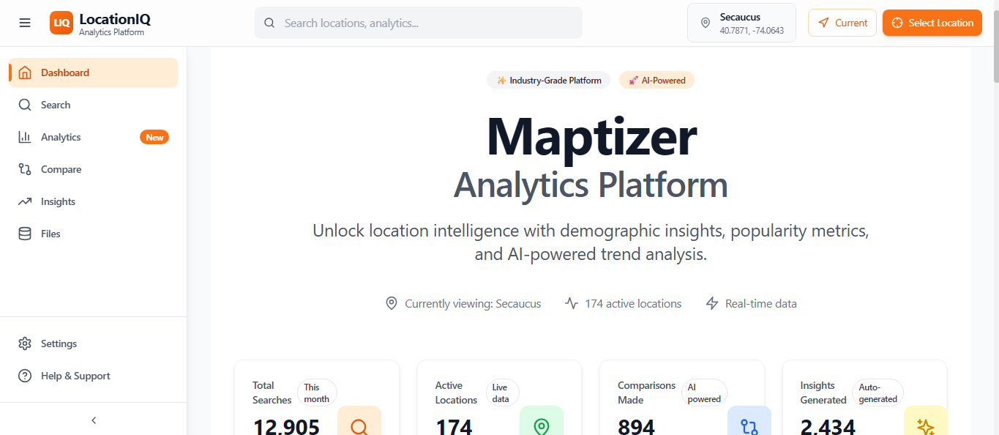
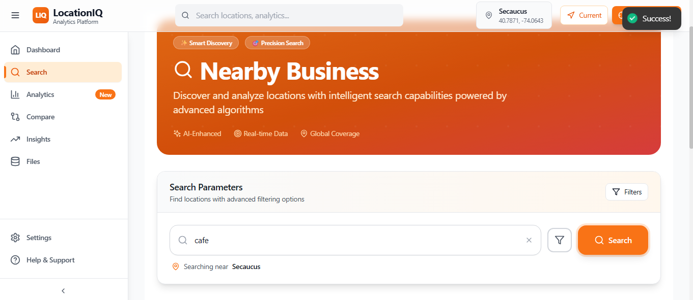
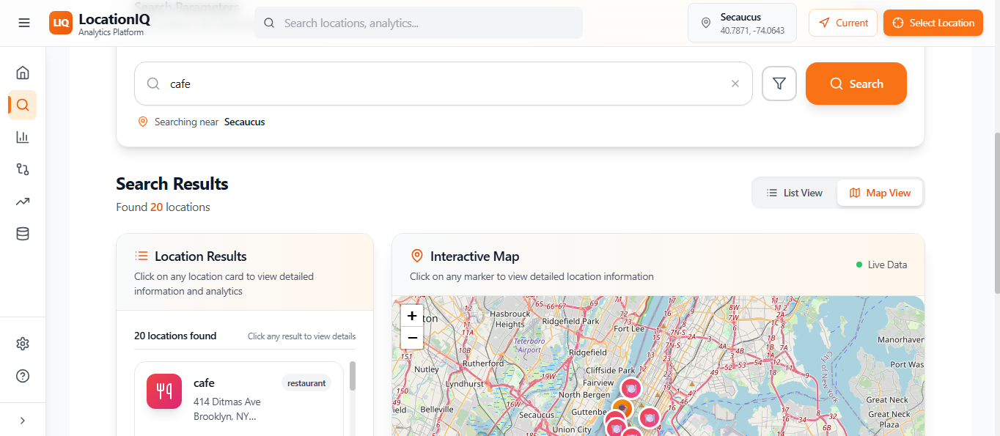
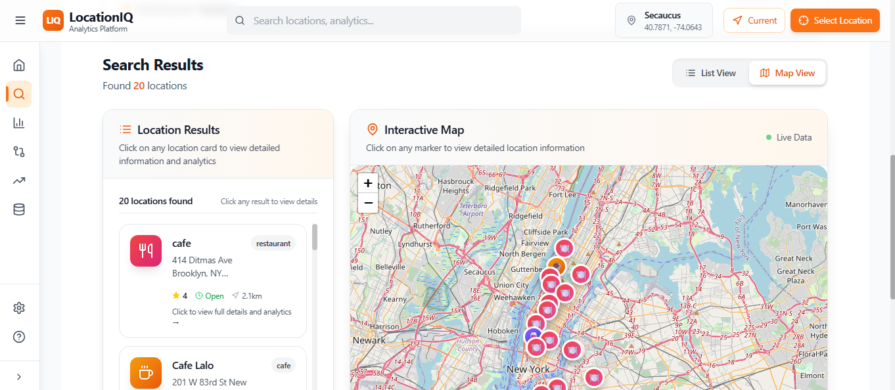
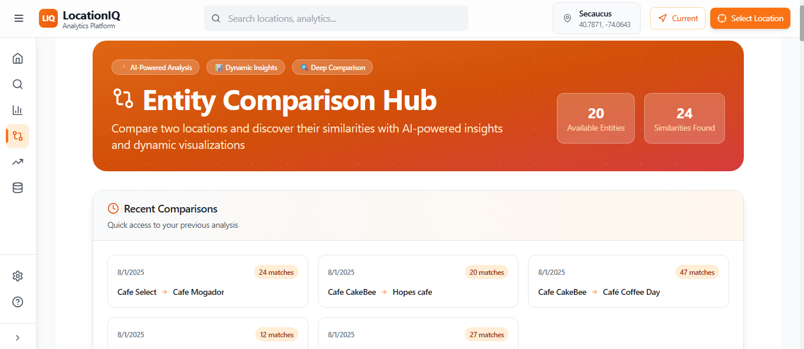
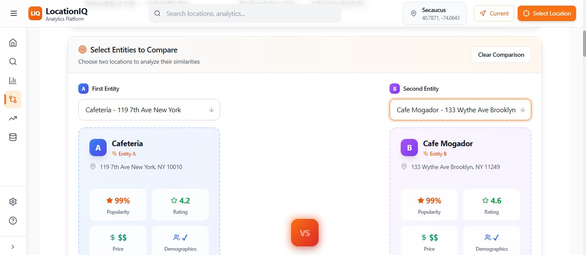
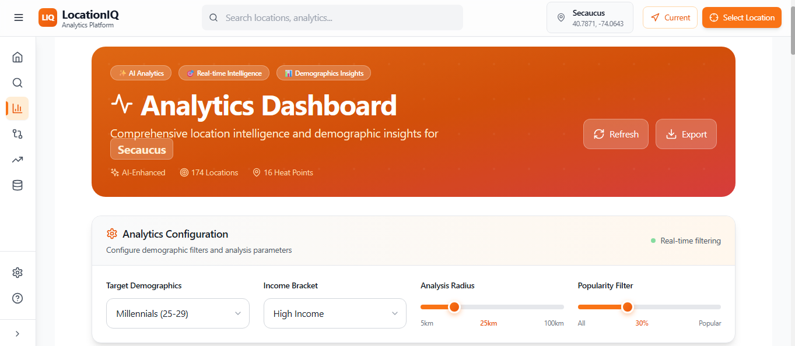
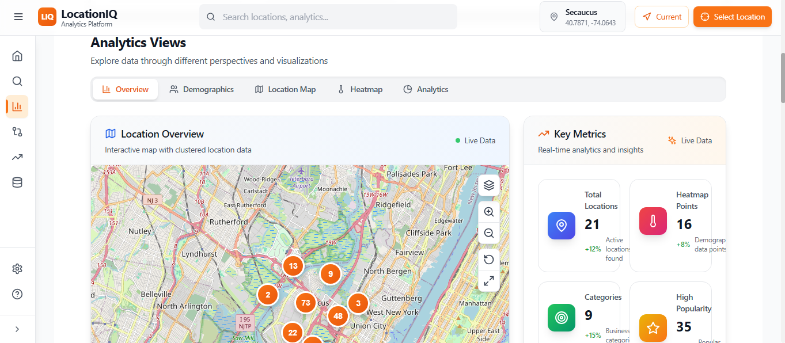
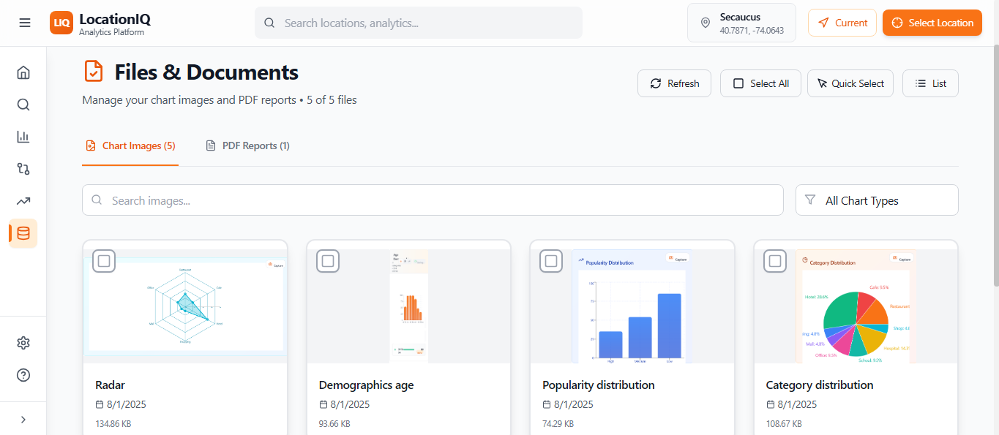
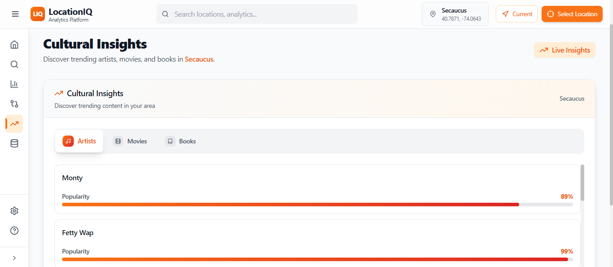

# 🗺️ Maptizer: Geo-AI Platform for Smart Location Intelligence

Maptizer is a powerful **Geospatial Analytics Platform** combining full-scale map interaction with AI-powered insights. Designed for developers, analysts, and researchers, it provides real-time, location-based intelligence using rich spatial data and intelligent visualization layers.

Harness the potential of **LocationIQ**, **Tailwind CSS**, **Vite**, **Qloo APIs**, and custom **AI/ML models** to extract actionable insights from maps, users, and dynamic geolocated data.

---

[](https://github.com/THILLAINATARAJAN-B/Maptizer)
[](https://tailwindcss.com/)
[](https://vitejs.dev/)

---

## 🌍 What is Maptizer?

> "Mapping meets Machine Learning — uncover patterns, predict trends, and interact with maps like never before."

Maptizer helps users evaluate **location feasibility** for businesses or events by analyzing geospatial data, culture, people behavior, and demand trends. Our integration with the **Qloo API** enables cultural, interest, and demographic insights based on location and tags (like cafés, gyms, art spaces, etc.).

---

## 🎯 Project Goal

Enable any user to:
- Select a **location** and **interest tags** (e.g., "tea shop", "bookstore", "music").
- Use **Qloo's entity and insight APIs** to gather population behavior, taste profiles, and location tags.
- Run AI/ML-powered **business feasibility analysis** to determine if a new business can succeed in that area.
- Get **data-driven predictions** using charts, heatmaps, and geo-visual analytics.

## 📸 Platform Screenshots

### 🏠 Homepage – Modern Dashboard Interface  
*Apple-inspired design with real-time statistics and quick actions*


---

### 🔍 Search Dashboard – AI-Enhanced Discovery  
*Intelligent location search with advanced filtering and real-time results*
  
  


---

### 🧠 Comparison Dashboard – Location Intelligence  
*Smart location comparison with AI-powered insights and analytics*  
  


---

### 📊 Analytics Dashboard – Demographic Insights  
*Advanced analytics with demographics, heatmaps, and interactive visualizations*  
  


---

### 📂 File Base – Structured Data Access  
*Organized file system for storing and accessing generated reports*  


---

### 🧭 Location Insights – Smart Intelligence  
*Deep location analytics with demographic and behavioral insights*  


### 🔍 **Smart Location Search**
- **AI-Enhanced Discovery**: Intelligent location search powered by QLOO API integration
- **Real-time Filtering**: Dynamic filters for demographics, popularity, radius, and income levels
- **Comprehensive Results**: Detailed location data with business insights and ratings
- **Interactive Map Integration**: Seamless search-to-map visualization workflow

### 📊 **Advanced Analytics Dashboard**
- **Interactive Visualizations**: Multiple chart types (bar, pie, area) with real-time data
- **Demographics Intelligence**: Age, gender, income, and location-based demographic analysis
- **Heatmap Visualization**: Geographic intensity mapping for demographic patterns
- **Export Capabilities**: Download analytics in JSON format and capture charts as images

### 🗺️ **Interactive Mapping System**
- **Clustered Markers**: Advanced marker clustering using React-Leaflet for optimal visualization
- **Multiple Map Views**: Switch between location overview, heatmap, and demographic layers
- **Real-time Updates**: Live data synchronization with automatic map refresh
- **Custom Overlays**: Demographic overlays and popularity indicators

### 🤖 **AI-Powered Insights**
- **GROQ Integration**: Advanced AI analysis using Groq's language models for location comparison
- **Automated Comparisons**: Intelligent location comparison with detailed AI-generated reports
- **Natural Language Summaries**: AI-generated insights and recommendations
- **PDF Report Generation**: Automated PDF creation for comparison analyses

### 👥 **Demographics Intelligence**
- **Comprehensive Analysis**: Age groups, gender distribution, income levels, and density mapping
- **Geographic Clustering**: Location-based demographic pattern recognition
- **Visual Representations**: Interactive charts with multiple visualization options
- **Data Export**: Capture demographic charts as images and export processed data

### 🎨 **Modern User Experience**
- **Apple-Inspired Design**: Clean, professional interface with consistent design language
- **Responsive Layout**: Seamless experience across desktop, tablet, and mobile devices
- **Accessibility**: WCAG compliant with keyboard navigation support
- **Session Management**: Secure session handling with automatic cleanup

## 🛠️ Technology Stack

### **Frontend Architecture**
```javascript
React 18.x          // Modern React with hooks and concurrent features
Vite 5.x           // Lightning-fast build tool and development server
Tailwind CSS 3.x   // Utility-first CSS framework for responsive design
React Router 6.x    // Client-side routing and navigation
Context API         // Global state management for application data
```

### **Data Visualization & Mapping**
```javascript
Recharts           // Composable charting library for React applications
Leaflet            // Interactive maps with advanced clustering features
React-Leaflet      // React components for Leaflet map integration
HTML2Canvas        // Chart capture and image generation
Lucide React       // Beautiful SVG icons for consistent UI
```

### **Backend Services**
```javascript
Node.js 18.x       // Server-side JavaScript runtime environment
Express.js 4.x     // Minimal web application framework
RESTful APIs       // Clean API architecture with proper error handling
Session Management // User session handling with automatic cleanup
File Processing    // PDF generation and image storage capabilities
```

### **External API Integrations**
```javascript
QLOO API          // Location data and demographic insights
Groq API          // Advanced AI language model for analysis
Geocoding APIs    // Location coordinate resolution
Session Storage   // Secure data persistence and management
```

### **Development & Quality Tools**
```javascript
ESLint            // Code linting and quality assurance
Prettier          // Automatic code formatting and consistency
Nodemon           // Development server with hot reload
Winston Logger    // Comprehensive logging system
```

## 🚀 Quick Start Guide

### **Prerequisites**
```bash
Node.js >= 18.0.0
npm >= 9.0.0
Git >= 2.30.0
```

### **Installation**

1. **Clone the Repository**
```bash
git clone https://github.com/THILLAINATARAJAN-B/Maptizer.git
cd Maptizer
```

2. **Backend Setup**
```bash
cd backend
npm install
```

3. **Frontend Setup**
```bash
cd ../frontend
npm install
```

4. **Environment Configuration**

**Backend (.env)**
```env
# Server Configuration
PORT=5000
NODE_ENV=development

# External API Keys
QLOO_API_KEY=your_qloo_api_key_here
GROQ_API_KEY=your_groq_api_key_here

# File Storage Configuration
DEMOGRAPHICS_FILE_PATH=./src/data/session/demographics.json
CHART_IMAGES_PATH=./src/data/chart-images/
PDF_STORAGE_PATH=./src/data/pdfs/

# Session Management
SESSION_CLEANUP_INTERVAL=3600000
MAX_SESSION_AGE=86400000
```

**Frontend (.env.local)**
```env
# API Configuration
VITE_API_URL=http://localhost:5000
VITE_API_TIMEOUT=30000

# Application Configuration
VITE_APP_NAME=LocationIQ Insights
VITE_MAP_TILES_URL=https://{s}.tile.openstreetmap.org/{z}/{x}/{y}.png

# Feature Configuration
VITE_ENABLE_CHART_CAPTURE=true
VITE_ENABLE_PDF_EXPORT=true
VITE_DEFAULT_MAP_CENTER_LAT=11.0168
VITE_DEFAULT_MAP_CENTER_LNG=76.9558
```

5. **Start Development Servers**

**Backend Server**
```bash
cd backend
npm run dev
# Server starts on http://localhost:5000
```

**Frontend Application**
```bash
cd frontend
npm run dev
# Application starts on http://localhost:3000
```

6. **Access the Application**
```
Frontend: http://localhost:3000
Backend API: http://localhost:5000
API Health Check: http://localhost:5000/api/health
```

## 📁 Project Architecture

### **Backend Structure**
```
backend/
├── src/
│   ├── controllers/          # API request handlers
│   │   ├── searchController.js      # Location search with QLOO API
│   │   ├── heatmapController.js     # Heatmap data generation
│   │   ├── insightsController.js    # AI insights with Groq
│   │   ├── entityController.js      # Entity comparison logic
│   │   ├── filesController.js       # File and image management
│   │   ├── pdfController.js         # PDF generation service
│   │   └── sessionController.js     # Session management
│   │
│   ├── services/             # Business logic layer
│   │   ├── qlooService.js          # QLOO API integration
│   │   ├── geoService.js           # Geolocation services
│   │   ├── pdfService.js           # PDF generation utilities
│   │   ├── summaryService.js       # AI summary generation
│   │   └── sessionCleanupService.js # Session cleanup automation
│   │
│   ├── routes/               # API routing
│   │   ├── apiRoutes.js           # Main application routes
│   │   └── healthRoutes.js        # Health check endpoints
│   │
│   ├── utils/                # Utility functions
│   │   ├── logger.js              # Winston logging configuration
│   │   ├── dataManager.js         # Data processing utilities
│   │   └── errorFormatter.js      # Error handling and formatting
│   │
│   └── data/                 # Application data storage
│       ├── session/              # Session data storage
│       ├── chart-images/         # Generated chart images
│       └── pdfs/                 # Generated PDF reports
│
├── server.js                 # Application entry point
└── package.json             # Dependencies and npm scripts
```

### **Frontend Structure**
```
frontend/
├── src/
│   ├── components/           # Reusable UI components
│   │   ├── analytics/             # Analytics dashboard components
│   │   │   ├── EnhancedAnalyticsChart.jsx
│   │   │   ├── LocationStatsPanel.jsx
│   │   │   └── CategoryBreakdown.jsx
│   │   │
│   │   ├── demographics/          # Demographics visualization
│   │   │   ├── DemographicsChart.jsx
│   │   │   └── DemographicsPanel.jsx
│   │   │
│   │   ├── maps/                  # Mapping components
│   │   │   ├── MapContainer.jsx
│   │   │   ├── HeatmapMap.jsx
│   │   │   ├── SearchMap.jsx
│   │   │   └── LocationDetailPopup.jsx
│   │   │
│   │   ├── search/                # Search interface components
│   │   │   ├── SearchForm.jsx
│   │   │   └── SearchResults.jsx
│   │   │
│   │   ├── insights/              # AI insights components
│   │   │   ├── ComparisonView.jsx
│   │   │   ├── InsightsPanel.jsx
│   │   │   └── PDFDownloadButton.jsx
│   │   │
│   │   ├── dashboard/             # Dashboard components
│   │   │   ├── Dashboard.jsx
│   │   │   └── StatsCards.jsx
│   │   │
│   │   └── ui/                    # Basic UI elements
│   │       ├── Button.jsx
│   │       ├── Card.jsx
│   │       └── Badge.jsx
│   │
│   ├── pages/                # Main application pages
│   │   ├── Home.jsx               # Landing page with dashboard
│   │   ├── Search.jsx             # Location search interface
│   │   ├── Analytics.jsx          # Analytics dashboard
│   │   ├── Compare.jsx            # AI comparison tool
│   │   ├── Insights.jsx           # Insights and trends page
│   │   └── Files.jsx              # File management interface
│   │
│   ├── hooks/                # Custom React hooks
│   │   ├── useApi.js              # API integration hook
│   │   ├── useLocalStorage.js     # Local storage management
│   │   └── useSessionCleanup.js   # Session cleanup hook
│   │
│   ├── context/              # React Context providers
│   │   └── AppContext.jsx         # Global application state
│   │
│   ├── services/             # External service integrations
│   │   ├── api.js                 # API client configuration
│   │   ├── dataService.js         # Data processing services
│   │   └── mapService.js          # Map service utilities
│   │
│   └── utils/                # Utility functions
│       ├── helpers.js             # General helper functions
│       ├── constants.js           # Application constants
│       └── cn.js                  # Tailwind class utilities
│
└── public/                   # Static assets and screenshots
```

## 🌐 API Reference

### **Core Endpoints**

#### **Location Search**
```http
POST /api/search/places
Content-Type: application/json

{
  "query": "restaurants",
  "lat": 11.0168,
  "lng": 76.9558,
  "radius": 25,
  "page": 1,
  "take": 20
}
```

**Response:**
```json
{
  "items": [
    {
      "entity_id": "entity_123",
      "name": "Restaurant Name",
      "location": {
        "latitude": 11.0168,
        "longitude": 76.9558,
        "address": "123 Main St, City"
      },
      "demographics": {
        "age": { "25_34": 0.4, "35_44": 0.3 },
        "gender": { "male": 0.6, "female": 0.4 }
      },
      "popularity": 0.8,
      "score": 0.92
    }
  ],
  "aggregatedAgeScores": {...},
  "aggregatedGenderScores": {...}
}
```

#### **Analytics Data**
```http
POST /api/analytics/combined
Content-Type: application/json

{
  "location": "Coimbatore",
  "radius": 15,
  "age": "25_to_29",
  "income": "high",
  "popularity": 0.3,
  "take": 50
}
```

#### **Heatmap Data**
```http
POST /api/heatmap/location
Content-Type: application/json

{
  "location": "Mumbai",
  "age": "25_to_29",
  "income": "high"
}
```

#### **AI Insights Generation**
```http
POST /api/insights/generate
Content-Type: application/json

{
  "entities": ["entity_1", "entity_2"],
  "analysisType": "comparison",
  "includeSummary": true
}
```

#### **Chart Image Storage**
```http
POST /api/save-chart-image
Content-Type: application/json

{
  "imageBase64": "data:image/png;base64,...",
  "chartType": "demographics-age",
  "chartId": "demo_age_1722528800000",
  "metadata": {...}
}
```

### **Health Check**
```http
GET /api/health

Response:
{
  "status": "healthy",
  "timestamp": "2024-08-01T19:30:00.000Z",
  "sessionId": "1722528600000",
  "version": "1.0.0"
}
```

## 🧪 Testing & Quality Assurance

### **Available Scripts**
```bash
# Development
npm run dev          # Start development server with hot reload
npm run build        # Build production bundle
npm run preview      # Preview production build locally

# Code Quality
npm run lint         # Run ESLint code analysis
npm run format       # Format code with Prettier
npm run type-check   # TypeScript type checking (if applicable)
```

### **Testing Strategy**
- **Manual Testing**: Comprehensive user workflow testing
- **API Testing**: Endpoint functionality and response validation
- **UI Testing**: Component rendering and interaction testing
- **Performance Testing**: Loading times and bundle size optimization
- **Cross-browser Testing**: Compatibility across modern browsers

## 🚀 Deployment Options

### **Local Production Build**
```bash
# Frontend Build
cd frontend
npm run build
npm run preview

# Backend Production
cd backend
NODE_ENV=production npm start
```

### **Docker Deployment** (Optional)
```dockerfile
# Example Dockerfile for containerization
FROM node:18-alpine
WORKDIR /app
COPY package*.json ./
RUN npm ci --only=production
COPY . .
EXPOSE 3000
CMD ["npm", "start"]
```

### **Cloud Deployment Platforms**
- **Vercel**: Optimal for frontend deployment with automatic CI/CD
- **Netlify**: Alternative frontend hosting with form handling
- **Railway**: Full-stack deployment with database integration
- **Heroku**: Traditional PaaS with add-on ecosystem

## 🔒 Security & Privacy

### **Security Implementation**
- **Input Validation**: Comprehensive data sanitization for all API endpoints
- **Environment Variables**: Secure handling of API keys and sensitive configuration
- **CORS Configuration**: Properly configured Cross-Origin Resource Sharing
- **Session Security**: Secure session management with automatic cleanup
- **Error Handling**: Structured error responses without exposing system details

### **Privacy Considerations**
- **Data Minimization**: Only necessary data is processed and stored
- **Session Management**: Automatic cleanup of temporary session data
- **API Security**: Secure communication with external service providers
- **Local Processing**: Demographic data processing without permanent storage

## 📈 Performance Optimization

### **Frontend Performance**
- **Code Splitting**: Route-based lazy loading for faster initial page loads
- **Image Optimization**: Responsive images with proper loading strategies
- **Bundle Optimization**: Tree shaking and dead code elimination
- **Caching Strategies**: Intelligent API response caching
- **Lazy Component Loading**: On-demand component loading

### **Backend Performance**
- **Response Optimization**: Compressed API responses with proper headers
- **Session Cleanup**: Automated cleanup to prevent memory leaks
- **Efficient Data Processing**: Optimized algorithms for demographic analysis
- **API Rate Management**: Proper handling of external API rate limits
- **Error Recovery**: Graceful handling of external service failures

### **Measured Performance Metrics**
- **First Contentful Paint**: 

| **Role** | **Responsibility** | **GitHub** |
|:--------:|:------------------:|:----------:|
| **Lead Developer & Architect** | Full-stack development, system design | [@THILLAINATARAJAN-B](https://github.com/THILLAINATARAJAN-B) |
| **Frontend Specialist** | React components, UI/UX implementation | Contributing |
| **Backend Developer** | API development, data processing | Contributing |
| **DevOps Engineer** | Deployment, CI/CD, infrastructure | Contributing |


### **Acknowledgments**
Special thanks to the open-source community and the following projects that make Maptizer possible:

- **[React Team](https://reactjs.org/)** - For the powerful React framework
- **[Tailwind CSS](https://tailwindcss.com/)** - For the utility-first CSS framework
- **[Leaflet](https://leafletjs.com/)** - For the interactive mapping library
- **[Recharts](https://recharts.org/)** - For beautiful chart components
- **[QLOO](https://qloo.com/)** - For comprehensive location and demographic data
- **[Groq](https://groq.com/)** - For advanced AI language model capabilities
- **[Vite](https://vitejs.dev/)** - For the fast build tool and development server

## 📞 Support & Community

### **Getting Help**
- 📖 **Documentation**: [Project Wiki](https://github.com/THILLAINATARAJAN-B/Maptizer/wiki)
- 🐛 **Bug Reports**: [GitHub Issues](https://github.com/THILLAINATARAJAN-B/Maptizer/issues)
- 💡 **Feature Requests**: [GitHub Discussions](https://github.com/THILLAINATARAJAN-B/Maptizer/discussions)
- 📧 **Direct Contact**: [Create an Issue](https://github.com/THILLAINATARAJAN-B/Maptizer/issues/new)

### **Community Guidelines**
- Be respectful and inclusive in all interactions
- Provide clear and detailed information when reporting issues
- Search existing issues before creating new ones
- Follow the code of conduct in all community spaces

---

### 🔗 Quick Links  
- 🌐 [**Live Demo**](https://maptizer-demo.vercel.app)  
- 📖 [**Documentation**](https://github.com/THILLAINATARAJAN-B/Maptizer/wiki)  
- 🐛 [**Report Bug**](https://github.com/THILLAINATARAJAN-B/Maptizer/issues)  
- 💡 [**Request Feature**](https://github.com/THILLAINATARAJAN-B/Maptizer/discussions)

---

## 🗺️ Development Roadmap

### **Current Version: 1.0.0**
✅ **Completed Features**
- [x] Core location search with QLOO API integration
- [x] Interactive analytics dashboard with multiple chart types
- [x] AI-powered location comparison using Groq
- [x] Comprehensive demographics visualization
- [x] Interactive mapping with clustering and heatmaps
- [x] PDF report generation and file management
- [x] Responsive design across all devices
- [x] Session management with automatic cleanup

### **Version 1.1.0 (Upcoming)**
🔄 **In Development**
- [ ] Enhanced search filters and sorting options
- [ ] Improved AI insights with more detailed analysis
- [ ] Additional chart types for demographics visualization
- [ ] Performance optimizations for large datasets
- [ ] Enhanced error handling and user feedback

### **Version 1.2.0 (Future)**
📋 **Planned Features**
- [ ] User authentication and personalized dashboards
- [ ] Data export in multiple formats (CSV, Excel)
- [ ] Advanced filtering options for analytics
- [ ] Integration with additional data sources
- [ ] Mobile-optimized progressive web app features

### **Long-term Vision (Version 2.0+)**
🌟 **Future Enhancements**
- [ ] Real-time data streaming and live updates
- [ ] Machine learning predictions for location trends
- [ ] Multi-language support for global users
- [ ] Advanced geospatial analysis tools
- [ ] Enterprise features and white-label solutions

## 📊 Project Statistics


![GitHub Language Count](https://img.shields.io/github/languages/count/THILLAINATARAJAN-B/Maptizer?](https://img.shields.io/github/languages/top/THILLAINATARAJAN-B/Maptizer?style= Size](https://img.shields.io/github/languages/code-size/THILL.io/github/repo-size/THILLAINATARAJANshields.io/github/commit-activity/m/THILLAINATARAJAN-B/Maptizer?

## 🌟 **Star History**

[![Star History Chart](https://api.star-history.com/svg?repos=THILLAINATARAJAN-B/Maptizer&type=com/#THILLAINATARAJAN-B/Maptizer& you find Maptizer useful, please consider giving it a star on GitHub!**

**🔗 Connect with the Project:**

[![GitHub](https://img.shields.io/In](https://img.shields.://img.shields.io/badge with ❤️ by developers, for location intelligence**

*Last updated: August 1, 2024*
